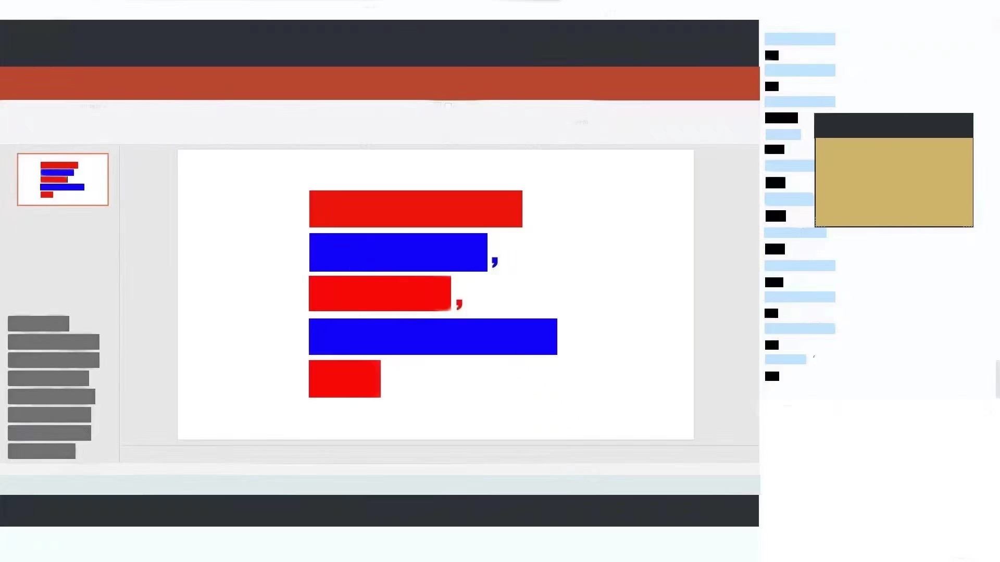

# Modern_Blue-Red-Beamer-Template

A modern-style beamer template with 65472 harmonic ratios, which is a limited edition for Matisu University (Technische Universität Martißu).

This color-style has nothing with Russian. **I support Ukraine 🇺🇦 and strongly condemned Russia's invasion.** Feel free to change the color-style to Blue and Yellow.
这个配色仅仅是为了鲜明的色彩，与俄罗斯无关。 **我们支持乌克兰人民，并强烈谴责俄罗斯的侵略行为。** 如果您希望，可以自由地把配色风格改为蓝色与黄色。

Seeking for Freedom of Speech, fictional protesting students changed the screen at the press conference of the university's comment section to slogan, whose color is blue and red.

在虚构的马蹄酥大学中，虚构的抗议学生将学校评论区防控小组的发布会改为了鲜明的红蓝颜色标语。

一个现代风格的beamer模版，配以65472调和比例，马蹄酥大学特别限定。

*Please note that this University and events related is only a fiction. Anyone did things like what this University done, the DIVINE PUNISHMENT will be adinistered.*

*马蹄酥大学及其相关事件均纯属虚构。如有雷同，天诛地灭！*

Note: this template stems from [NoNo721's beamer template of Tongji University](https://github.com/NoNo721/College-Beamer-Template), which also stems from [Trinkle23897's beamer template of Tsinghua University](https://github.com/Trinkle23897/THU-Beamer-Theme).
